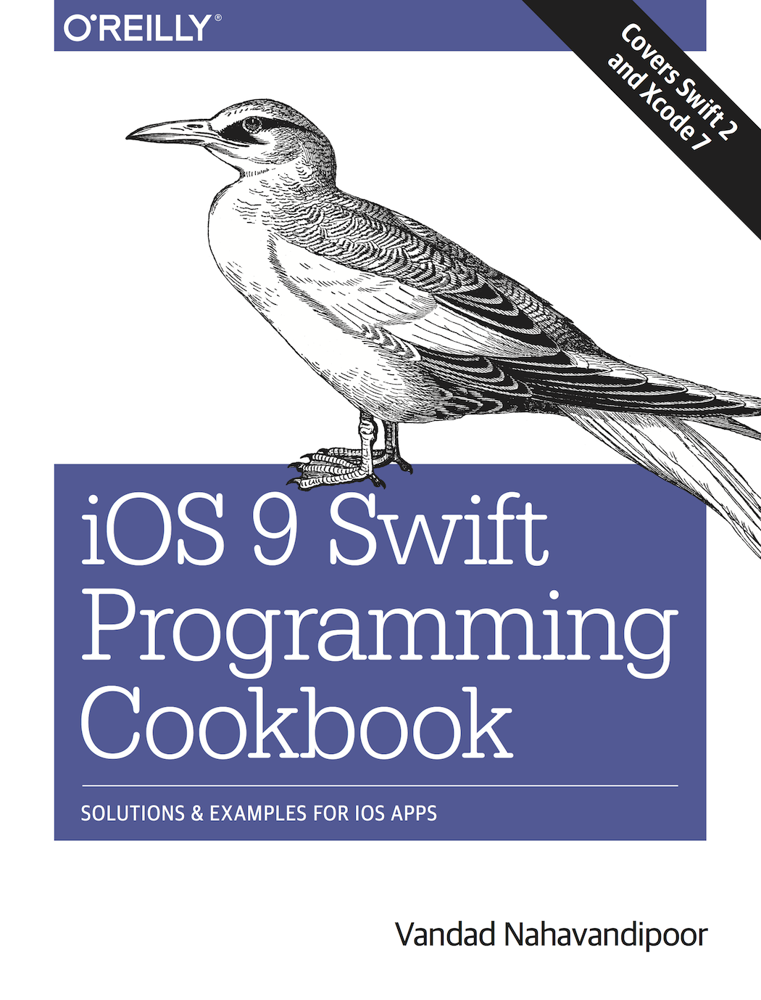

# iOS 9 Swift Programming-Cookbook's Example Code
This repository contains all example codes for O'Reilly's iOS 9 Swift Programming Cookbook (purchase here: [http://shop.oreilly.com/product/0636920044338.do](http://shop.oreilly.com/product/0636920044338.do))

## Xcode 8, Swift 3
There is a branch called [swift3.0](https://github.com/vandadnp/iOS-9-Swift-Programming-Cookbook/tree/swift3.0) which has all the source code in the master branch, but updated for Xcode 8 and Swift 3.0 ([click here to go to that branch](https://github.com/vandadnp/iOS-9-Swift-Programming-Cookbook/tree/swift3.0)).

## Xcode 7, Swift 2.0

All code on the [master branch](https://github.com/vandadnp/iOS-9-Swift-Programming-Cookbook/tree/master) has been tested with Xcode Version 7.0.1 (7A1001)

## Using the Souce code
If you would like to use this source code, as it is, in your own apps or copy paste this code anywhere, including StackOverflow, please do credit me by mentioning my name. Thank you.

## Contributing
If you have found an issue in the source code, please just [file an issue here](https://github.com/vandadnp/iOS-9-Swift-Programming-Cookbook/issues).

## Questions
If you have any questions regarding the book, please [ask me directly](mailto:vandad.np@gmail.com?subject=Question regarding repo for iOS 9 Cookbook).
